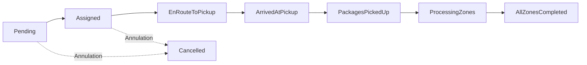
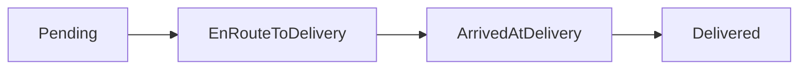

# Grouped Delivery API

<Note>
  **Production Ready** - Livraisons groupées multi-zones (1-5 destinations)
</Note>

La livraison groupée permet de livrer plusieurs destinations (1 à 5 zones) à partir d'un seul point de départ, avec optimisation de trajet et progression par zone.

## 🚀 Quick Start

<Steps>
  <Step title="Créer la livraison groupée">
    1 pickup + 1-5 zones de livraison
  </Step>
  <Step title="Assignation automatique">
    Le système assigne un agent disponible
  </Step>
  <Step title="Progression par zone">
    Chaque zone progresse indépendamment
  </Step>
  <Step title="Complétion séquentielle">
    Zone 1 → Zone 2 → Zone 3...
  </Step>
</Steps>

## 📦 Caractéristiques

<CardGroup cols={2}>
  <Card title="Multi-zones" icon="map-location-dot">
    1 à 5 zones de livraison
    - Progression indépendante par zone
    - Vérification de séquence
    - Prix proportionnel à la distance
  </Card>
  
  <Card title="Optimisation" icon="route">
    Trajet optimisé automatiquement
    - Calcul distance totale
    - Répartition prix par zone
    - Estimation durée globale
  </Card>
</CardGroup>

## 💻 Setup & Configuration

### Schémas Zod

```typescript
// lib/schemas/grouped-delivery.schema.ts
import { z } from 'zod';
import { LocationSchema } from './delivery.schema';

export const ZoneSchema = z.object({
  zone_number: z.number().int().min(1).max(5),
  delivery_address: z.string().min(5),
  delivery_location: LocationSchema,
  delivery_contact: z.string().regex(/^\+225\d{10}$/),
  delivery_instructions: z.string().optional(),
  package_description: z.string().min(3),
  package_weight_kg: z.number().positive().optional(),
  package_value: z.number().nonnegative().optional(),
  is_fragile: z.boolean().default(false),
  scheduled_delivery: z.string().datetime().optional(),
});

export const CreateGroupedDeliverySchema = z.object({
  pickup_address: z.string().min(5),
  pickup_location: LocationSchema,
  pickup_contact: z.string().regex(/^\+225\d{10}$/),
  pickup_instructions: z.string().optional(),
  zones: z.array(ZoneSchema).min(1).max(5),
  priority: z.enum(['Normal', 'Urgent']).default('Normal'),
  scheduled_pickup: z.string().datetime().optional(),
  payment_method: z.enum(['Cash', 'Card', 'MobileMoney']),
});

export type Zone = z.infer<typeof ZoneSchema>;
export type CreateGroupedDeliveryInput = z.infer<typeof CreateGroupedDeliverySchema>;

// Schémas de réponse
export const ZoneResponseSchema = z.object({
  id: z.string().uuid(),
  order_id: z.string().uuid(),
  zone_number: z.number(),
  delivery_address: z.string(),
  delivery_location: LocationSchema,
  package_description: z.string(),
  status: z.enum([
    'Pending',
    'EnRouteToDelivery',
    'ArrivedAtDelivery',
    'Delivered',
  ]),
  zone_price: z.number(),
  is_cancelled: z.boolean(),
  created_at: z.string().datetime(),
});

export const GroupedOrderSchema = z.object({
  id: z.string().uuid(),
  group_number: z.string(),
  status: z.enum([
    'Pending',
    'Assigned',
    'EnRouteToPickup',
    'ArrivedAtPickup',
    'PackagesPickedUp',
    'ProcessingZones',
    'AllZonesCompleted',
    'Cancelled',
  ]),
  pickup_address: z.string(),
  pickup_location: LocationSchema,
  zones: z.array(ZoneResponseSchema),
  total_zones: z.number(),
  completed_zones: z.number(),
  total_price: z.number(),
  agent: z.object({
    id: z.string().uuid(),
    name: z.string(),
    phone: z.string(),
  }).optional(),
  created_at: z.string().datetime(),
});

export type ZoneResponse = z.infer<typeof ZoneResponseSchema>;
export type GroupedOrder = z.infer<typeof GroupedOrderSchema>;
```

## 🔌 API Hooks (TanStack Query)

```typescript
// lib/api/hooks/useGroupedDelivery.ts
import { useMutation, useQuery, useQueryClient } from '@tanstack/react-query';
import api from '../axios';
import { CreateGroupedDeliveryInput, GroupedOrder } from '@/lib/schemas/grouped-delivery.schema';

// Créer une livraison groupée
export const useCreateGroupedDelivery = () => {
  const queryClient = useQueryClient();
  
  return useMutation({
    mutationFn: async (data: CreateGroupedDeliveryInput) => {
      const response = await api.post('/api/delivery/grouped/orders', data);
      return response.data.data as GroupedOrder;
    },
    onSuccess: () => {
      queryClient.invalidateQueries({ queryKey: ['grouped-deliveries'] });
    },
  });
};

// Récupérer une livraison groupée
export const useGroupedDelivery = (groupId: string) => {
  return useQuery({
    queryKey: ['grouped-delivery', groupId],
    queryFn: async () => {
      const response = await api.get(`/api/delivery/grouped/orders/${groupId}`);
      return response.data.data as GroupedOrder;
    },
    enabled: !!groupId,
    refetchInterval: (data) => {
      if (data?.status === 'AllZonesCompleted' || data?.status === 'Cancelled') {
        return false;
      }
      return 10000; // Poll toutes les 10 secondes
    },
  });
};

// Lister mes livraisons groupées
export const useGroupedDeliveries = (page = 1, perPage = 10) => {
  return useQuery({
    queryKey: ['grouped-deliveries', page, perPage],
    queryFn: async () => {
      const params = new URLSearchParams({
        page: page.toString(),
        per_page: perPage.toString(),
      });
      const response = await api.get(`/api/delivery/grouped/orders?${params}`);
      return response.data;
    },
  });
};

// Avancer le statut d'une zone
export const useAdvanceZoneStatus = () => {
  const queryClient = useQueryClient();
  
  return useMutation({
    mutationFn: async ({ groupId, zoneNumber }: { groupId: string; zoneNumber: number }) => {
      const response = await api.post(
        `/api/delivery/grouped/orders/${groupId}/zones/${zoneNumber}/advance`
      );
      return response.data.data;
    },
    onSuccess: (_, variables) => {
      queryClient.invalidateQueries({ queryKey: ['grouped-delivery', variables.groupId] });
    },
  });
};

// Compléter une zone
export const useCompleteZone = () => {
  const queryClient = useQueryClient();
  
  return useMutation({
    mutationFn: async ({
      groupId,
      zoneNumber,
      deliveryCode,
      agentNotes,
    }: {
      groupId: string;
      zoneNumber: number;
      deliveryCode: string;
      agentNotes?: string;
    }) => {
      const response = await api.post(
        `/api/delivery/grouped/orders/${groupId}/zones/${zoneNumber}/complete`,
        { delivery_code: deliveryCode, agent_notes: agentNotes }
      );
      return response.data.data;
    },
    onSuccess: (_, variables) => {
      queryClient.invalidateQueries({ queryKey: ['grouped-delivery', variables.groupId] });
    },
  });
};

// Annuler une livraison groupée
export const useCancelGroupedDelivery = () => {
  const queryClient = useQueryClient();
  
  return useMutation({
    mutationFn: async ({ groupId, reason }: { groupId: string; reason: string }) => {
      const response = await api.post(
        `/api/delivery/grouped/orders/${groupId}/cancel`,
        { reason }
      );
      return response.data.data;
    },
    onSuccess: (_, variables) => {
      queryClient.invalidateQueries({ queryKey: ['grouped-delivery', variables.groupId] });
      queryClient.invalidateQueries({ queryKey: ['grouped-deliveries'] });
    },
  });
};
```

## 🎨 Composants React / Next.js

### Formulaire de création

```typescript
// components/CreateGroupedDeliveryForm.tsx
'use client';

import { useForm, useFieldArray } from 'react-hook-form';
import { zodResolver } from '@hookform/resolvers/zod';
import { CreateGroupedDeliverySchema, CreateGroupedDeliveryInput } from '@/lib/schemas/grouped-delivery.schema';
import { useCreateGroupedDelivery } from '@/lib/api/hooks/useGroupedDelivery';

export default function CreateGroupedDeliveryForm() {
  const { mutate: createDelivery, isPending } = useCreateGroupedDelivery();
  
  const {
    register,
    control,
    handleSubmit,
    formState: { errors },
  } = useForm<CreateGroupedDeliveryInput>({
    resolver: zodResolver(CreateGroupedDeliverySchema),
    defaultValues: {
      zones: [{ zone_number: 1, is_fragile: false }],
      priority: 'Normal',
    },
  });
  
  const { fields, append, remove } = useFieldArray({
    control,
    name: 'zones',
  });
  
  const onSubmit = (data: CreateGroupedDeliveryInput) => {
    createDelivery(data, {
      onSuccess: (order) => {
        window.location.href = `/track/grouped/${order.id}`;
      },
      onError: (error: any) => {
        alert(error.response?.data?.message || 'Erreur');
      },
    });
  };
  
  return (
    <form onSubmit={handleSubmit(onSubmit)} className="space-y-6">
      {/* Pickup Section */}
      <div className="bg-white p-4 rounded shadow">
        <h3 className="font-bold mb-4">Point de ramassage</h3>
        
        <div className="space-y-4">
          <div>
            <label>Adresse</label>
            <input
              {...register('pickup_address')}
              className="w-full p-2 border rounded"
              placeholder="Entrepôt Treichville"
            />
            {errors.pickup_address && (
              <p className="text-red-500 text-sm">{errors.pickup_address.message}</p>
            )}
          </div>
          
          <div className="grid grid-cols-2 gap-4">
            <div>
              <label>Latitude</label>
              <input
                {...register('pickup_location.lat', { valueAsNumber: true })}
                type="number"
                step="any"
                className="w-full p-2 border rounded"
              />
            </div>
            <div>
              <label>Longitude</label>
              <input
                {...register('pickup_location.lng', { valueAsNumber: true })}
                type="number"
                step="any"
                className="w-full p-2 border rounded"
              />
            </div>
          </div>
          
          <div>
            <label>Contact</label>
            <input
              {...register('pickup_contact')}
              className="w-full p-2 border rounded"
              placeholder="+225 0303030303"
            />
          </div>
        </div>
      </div>
      
      {/* Zones Section */}
      <div className="bg-white p-4 rounded shadow">
        <div className="flex justify-between items-center mb-4">
          <h3 className="font-bold">Zones de livraison ({fields.length}/5)</h3>
          {fields.length < 5 && (
            <button
              type="button"
              onClick={() => append({ zone_number: fields.length + 1, is_fragile: false })}
              className="bg-blue-500 text-white px-4 py-2 rounded"
            >
              + Ajouter une zone
            </button>
          )}
        </div>
        
        {fields.map((field, index) => (
          <div key={field.id} className="border p-4 rounded mb-4">
            <div className="flex justify-between items-center mb-2">
              <h4 className="font-semibold">Zone {index + 1}</h4>
              {fields.length > 1 && (
                <button
                  type="button"
                  onClick={() => remove(index)}
                  className="text-red-500"
                >
                  Supprimer
                </button>
              )}
            </div>
            
            <div className="space-y-4">
              <input type="hidden" {...register(`zones.${index}.zone_number` as const)} value={index + 1} />
              
              <div>
                <label>Adresse de livraison</label>
                <input
                  {...register(`zones.${index}.delivery_address` as const)}
                  className="w-full p-2 border rounded"
                  placeholder="Marcory Zone 4"
                />
              </div>
              
              <div className="grid grid-cols-2 gap-4">
                <div>
                  <label>Latitude</label>
                  <input
                    {...register(`zones.${index}.delivery_location.lat` as const, { valueAsNumber: true })}
                    type="number"
                    step="any"
                    className="w-full p-2 border rounded"
                  />
                </div>
                <div>
                  <label>Longitude</label>
                  <input
                    {...register(`zones.${index}.delivery_location.lng` as const, { valueAsNumber: true })}
                    type="number"
                    step="any"
                    className="w-full p-2 border rounded"
                  />
                </div>
              </div>
              
              <div>
                <label>Contact</label>
                <input
                  {...register(`zones.${index}.delivery_contact` as const)}
                  className="w-full p-2 border rounded"
                  placeholder="+225 0111111111"
                />
              </div>
              
              <div>
                <label>Description du colis</label>
                <input
                  {...register(`zones.${index}.package_description` as const)}
                  className="w-full p-2 border rounded"
                  placeholder="Colis Zone 1"
                />
              </div>
              
              <div className="flex items-center gap-2">
                <input {...register(`zones.${index}.is_fragile` as const)} type="checkbox" />
                <label>Colis fragile</label>
              </div>
            </div>
          </div>
        ))}
      </div>
      
      {/* Payment Section */}
      <div className="bg-white p-4 rounded shadow">
        <h3 className="font-bold mb-4">Paiement</h3>
        <select {...register('payment_method')} className="w-full p-2 border rounded">
          <option value="Cash">Espèces</option>
          <option value="Card">Carte bancaire</option>
          <option value="MobileMoney">Mobile Money</option>
        </select>
      </div>
      
      <button
        type="submit"
        disabled={isPending}
        className="w-full bg-blue-500 text-white p-3 rounded font-bold"
      >
        {isPending ? 'Création...' : 'Créer la livraison groupée'}
      </button>
    </form>
  );
}
```

### Suivi de livraison groupée

```typescript
// components/GroupedDeliveryTracker.tsx
'use client';

import { useGroupedDelivery } from '@/lib/api/hooks/useGroupedDelivery';
import { useEffect } from 'react';
import { getSocket, initSocket } from '@/lib/api/socket';

interface GroupedDeliveryTrackerProps {
  groupId: string;
}

export default function GroupedDeliveryTracker({ groupId }: GroupedDeliveryTrackerProps) {
  const { data: order, isLoading } = useGroupedDelivery(groupId);
  
  useEffect(() => {
    const token = localStorage.getItem('access_token');
    if (!token) return;
    
    const socket = initSocket(token);
    
    socket.emit('subscribe:grouped_order', groupId);
    
    socket.on('grouped_order:status_updated', (data) => {
      if (data.group_id === groupId) {
        console.log('Statut mis à jour:', data);
      }
    });
    
    socket.on('zone:status_updated', (data) => {
      if (data.group_id === groupId) {
        console.log('Zone mise à jour:', data);
      }
    });
    
    return () => {
      socket.emit('unsubscribe:grouped_order', groupId);
      socket.off('grouped_order:status_updated');
      socket.off('zone:status_updated');
    };
  }, [groupId]);
  
  if (isLoading) return <div>Chargement...</div>;
  if (!order) return <div>Commande non trouvée</div>;
  
  return (
    <div className="space-y-4">
      <div className="bg-white p-4 rounded shadow">
        <h2 className="text-xl font-bold">Livraison groupée {order.group_number}</h2>
        <StatusBadge status={order.status} />
        <p className="mt-2">
          Zones complétées: {order.completed_zones}/{order.total_zones}
        </p>
      </div>
      
      {order.agent && (
        <div className="bg-white p-4 rounded shadow">
          <h3 className="font-bold">Votre livreur</h3>
          <p>{order.agent.name}</p>
          <a href={`tel:${order.agent.phone}`} className="text-blue-500">
            {order.agent.phone}
          </a>
        </div>
      )}
      
      <div className="bg-white p-4 rounded shadow">
        <h3 className="font-bold mb-4">Zones de livraison</h3>
        <div className="space-y-4">
          {order.zones.map((zone) => (
            <ZoneCard key={zone.id} zone={zone} />
          ))}
        </div>
      </div>
    </div>
  );
}

function ZoneCard({ zone }: { zone: any }) {
  const statusColors = {
    Pending: 'bg-gray-100 text-gray-800',
    EnRouteToDelivery: 'bg-blue-100 text-blue-800',
    ArrivedAtDelivery: 'bg-purple-100 text-purple-800',
    Delivered: 'bg-green-100 text-green-800',
  };
  
  return (
    <div className="border p-4 rounded">
      <div className="flex justify-between items-center">
        <h4 className="font-semibold">Zone {zone.zone_number}</h4>
        <span className={`px-3 py-1 rounded-full text-sm ${statusColors[zone.status]}`}>
          {zone.status}
        </span>
      </div>
      <p className="text-sm text-gray-600 mt-2">{zone.delivery_address}</p>
      <p className="text-sm text-gray-600">{zone.package_description}</p>
      {zone.is_cancelled && (
        <p className="text-red-500 text-sm mt-2">❌ Annulée</p>
      )}
    </div>
  );
}

function StatusBadge({ status }: { status: string }) {
  const colors = {
    Pending: 'bg-yellow-100 text-yellow-800',
    Assigned: 'bg-blue-100 text-blue-800',
    EnRouteToPickup: 'bg-purple-100 text-purple-800',
    PackagesPickedUp: 'bg-indigo-100 text-indigo-800',
    ProcessingZones: 'bg-orange-100 text-orange-800',
    AllZonesCompleted: 'bg-green-100 text-green-800',
    Cancelled: 'bg-red-100 text-red-800',
  };
  
  return (
    <span className={`px-3 py-1 rounded-full text-sm ${colors[status] || 'bg-gray-100'}`}>
      {status}
    </span>
  );
}
```

## 📡 Endpoints API

### 1. Créer une livraison groupée

```bash
POST /api/delivery/grouped/orders
Authorization: Bearer <access_token>
Content-Type: application/json

{
  "pickup_address": "Entrepôt Treichville",
  "pickup_location": {"lat": 5.28, "lng": -4.00},
  "pickup_contact": "+225 0303030303",
  "zones": [
    {
      "zone_number": 1,
      "delivery_address": "Marcory Zone 4",
      "delivery_location": {"lat": 5.30, "lng": -3.98},
      "delivery_contact": "+225 0111111111",
      "package_description": "Colis Zone 1",
      "is_fragile": false
    },
    {
      "zone_number": 2,
      "delivery_address": "Koumassi Remblais",
      "delivery_location": {"lat": 5.29, "lng": -3.95},
      "delivery_contact": "+225 0222222222",
      "package_description": "Colis Zone 2",
      "is_fragile": false
    }
  ],
  "priority": "Normal",
  "payment_method": "Cash"
}
```

**Réponse** :
```json
{
  "success": true,
  "data": {
    "id": "uuid",
    "group_number": "GRP123456",
    "status": "Pending",
    "total_zones": 2,
    "completed_zones": 0,
    "total_price": 2800.0,
    "zones": [
      {
        "id": "zone-uuid-1",
        "zone_number": 1,
        "delivery_address": "Marcory Zone 4",
        "status": "Pending",
        "zone_price": 1400.0
      },
      {
        "id": "zone-uuid-2",
        "zone_number": 2,
        "delivery_address": "Koumassi Remblais",
        "status": "Pending",
        "zone_price": 1400.0
      }
    ]
  }
}
```

### 2. Récupérer une livraison groupée

```bash
GET /api/delivery/grouped/orders/{group_id}
Authorization: Bearer <access_token>
```

### 3. Lister mes livraisons groupées

```bash
GET /api/delivery/grouped/orders?page=1&per_page=10
Authorization: Bearer <access_token>
```

### 4. Avancer le statut d'une zone (Agent)

```bash
POST /api/delivery/grouped/orders/{group_id}/zones/{zone_number}/advance
Authorization: Bearer <agent_token>
```

**Progression** :
- `Pending` → `EnRouteToDelivery`
- `EnRouteToDelivery` → `ArrivedAtDelivery`
- `ArrivedAtDelivery` → Utiliser `/complete`

### 5. Compléter une zone (Agent)

```bash
POST /api/delivery/grouped/orders/{group_id}/zones/{zone_number}/complete
Authorization: Bearer <agent_token>
Content-Type: application/json

{
  "delivery_code": "CODE123",
  "agent_notes": "Livré au gardien"
}
```

<Warning>
  Les zones doivent être complétées dans l'ordre : Zone 1 → Zone 2 → Zone 3...
</Warning>

### 6. Avancer le statut global (Agent)

```bash
POST /api/delivery/grouped/orders/{group_id}/advance
Authorization: Bearer <agent_token>
```

### 7. Annuler une livraison groupée

```bash
POST /api/delivery/grouped/orders/{group_id}/cancel
Authorization: Bearer <access_token>
Content-Type: application/json

{
  "reason": "Client a annulé"
}
```

## 🔄 Flux de Statuts

### Statut Global



### Statut par Zone



## 💰 Tarification

<Note>
  Le prix est calculé proportionnellement à la distance de chaque zone
</Note>

### Formule

```
Prix Total = Base + (Distance totale × Prix/km)
Prix Zone = (Distance zone / Distance totale) × Prix Total
```

### Exemple (2 zones)

**Trajet** :
- Pickup → Zone 1 : 8 km
- Zone 1 → Zone 2 : 5 km
- **Total** : 13 km

**Calcul** :
- Base : 600 FCFA
- Distance : 13 km × 100 FCFA/km = 1300 FCFA
- **Total** : 1900 FCFA

**Répartition** :
- Zone 1 : (8/13) × 1900 = 1169 FCFA
- Zone 2 : (5/13) × 1900 = 731 FCFA

## 🎯 Cas d'Usage

### E-commerce Multi-clients

```typescript
// Livrer plusieurs commandes depuis un entrepôt
const createMultiDelivery = async (orders: Order[]) => {
  const zones = orders.map((order, index) => ({
    zone_number: index + 1,
    delivery_address: order.shipping_address,
    delivery_location: order.coordinates,
    delivery_contact: order.customer_phone,
    package_description: `Commande #${order.id}`,
    is_fragile: order.items.some(item => item.fragile),
  }));
  
  const groupedDelivery = await createGroupedDelivery({
    pickup_address: warehouse.address,
    pickup_location: warehouse.coordinates,
    pickup_contact: warehouse.phone,
    zones,
    payment_method: 'Prepaid',
  });
  
  return groupedDelivery;
};
```

## 📚 Voir Aussi

- [Standard Delivery](/api-reference/delivery-standard) - Livraisons point-à-point
- [Moving Service](/api-reference/delivery-moving) - Service de déménagement
- [Pricing & Wallet](/api-reference/delivery-pricing-wallet) - Configuration des frais
