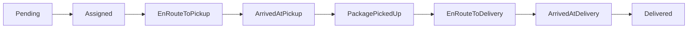

# Delivery API

<Note>
  **Production Ready** - Module complet avec 4 types de livraison testés et validés
</Note>

L'API Delivery est une plateforme complète de gestion de livraisons avec 4 modules spécialisés, un système de pricing optimisé, et des protections contre les race conditions.

## 📦 Modules Disponibles

<CardGroup cols={2}>
  <Card title="Standard Delivery" icon="box" href="/api-reference/delivery-standard">
    Livraisons point-à-point simples et express
    - Base: 500 FCFA + 80 FCFA/km
    - Express: 700 FCFA + 85 FCFA/km
    - Assignation automatique d'agent
  </Card>
  
  <Card title="Grouped Delivery" icon="boxes-stacked" href="/api-reference/delivery-grouped">
    Livraisons groupées multi-zones (1-5 zones)
    - Base: 600 FCFA + 80 FCFA/km
    - Progression par zone
    - Optimisation de tournée
  </Card>
  
  <Card title="Moving Service" icon="truck-moving" href="/api-reference/delivery-moving">
    Service de déménagement complet
    - Base: 10000 FCFA + 500 FCFA/km
    - Gestion d'équipe et inventaire
    - Calcul automatique des besoins
  </Card>
  
  <Card title="Overview" icon="book" href="/api-reference/delivery-overview">
    Vue d'ensemble et ressources partagées
    - Architecture
    - Flux de statuts
    - Bonnes pratiques
  </Card>
</CardGroup>

## ✅ Statut de Production

| Fonctionnalité | Statut | Notes |
|----------------|--------|-------|
| **STANDARD Delivery** | ✅ Production Ready | Testé de bout en bout |
| **EXPRESS Delivery** | ✅ Production Ready | Priorité et tarif majoré |
| **GROUPED Delivery** | ✅ Production Ready | Multi-zones avec progression individuelle |
| **MOVING Service** | ✅ Production Ready | Équipe, inventaire, calcul besoins |
| **Pricing System** | ✅ Production Ready | Arrondi automatique au 100 FCFA supérieur |
| **Agent Assignment** | ✅ Production Ready | Protection race condition atomique |
| **Status Progression** | ✅ Production Ready | Protection race condition atomique |
| **Real-time Tracking** | 🚧 En développement | Via module Pulse |
| **Cancellation** | 🚧 À implémenter | Avec gestion remboursement |

## 🎯 Pricing Structure

Tous les prix incluent **10% de frais de service** et sont **arrondis à la centaine supérieure**.

### Exemples de Prix

| Type | Distance | Prix Calculé | Prix Final |
|------|----------|--------------|------------|
| STANDARD | 5 km | 987 FCFA | **1000 FCFA** |
| EXPRESS | 5 km | 1235 FCFA | **1300 FCFA** |
| GROUPED (2 zones) | 10 km | 2720 FCFA | **2800 FCFA** |
| MOVING | 15 km + 20m³ | 64900 FCFA | **64900 FCFA** |

<Tip>
  Les prix sont toujours arrondis vers le haut : 101 FCFA → 200 FCFA, 567 FCFA → 600 FCFA
</Tip>

## 🔒 Sécurité & Performance

### Protection Race Conditions

Le module implémente des protections atomiques au niveau base de données :

<AccordionGroup>
  <Accordion title="Agent Assignment Protection">
    **Problème résolu** : Empêche qu'un agent soit assigné à trop de commandes simultanément
    
    **Solution** : Vérification atomique SQL avec `NOT EXISTS` pour compter les commandes actives
    
    ```sql
    WHERE agent_id IS NULL 
      AND NOT EXISTS (
        SELECT 1 FROM delivery_orders 
        WHERE agent_id = $1 
        AND status NOT IN ('Pending', 'Delivered', 'Cancelled')
      )
    ```
    
    **Résultat** : Agent limité à 4-5 commandes actives maximum
  </Accordion>
  
  <Accordion title="Status Progression Protection">
    **Problème résolu** : Empêche les sauts de statuts (Pending → Delivered directement)
    
    **Solution** : Vérification du statut actuel dans la clause WHERE
    
    ```sql
    UPDATE delivery_orders 
    SET status = $new_status 
    WHERE id = $order_id 
      AND status = $expected_current_status
    ```
    
    **Résultat** : Progression séquentielle garantie
  </Accordion>
</AccordionGroup>

### Performance

- **Assignation** : < 100ms (recherche optimisée avec distance Haversine)
- **Progression statut** : < 50ms (update atomique)
- **Estimation prix** : < 10ms (calcul en mémoire)
- **Création commande** : < 200ms (avec validation et pricing)

## 🔧 Ressources Communes

### Authentification

<Warning>
  Toutes les routes nécessitent un token JWT valide
</Warning>

```http
Authorization: Bearer <access_token>
```

### Agents (Livreurs)

<CodeGroup>
```bash Créer un agent
curl -X POST https://api.ono.ci/api/delivery/agents \
  -H "Authorization: Bearer $TOKEN" \
  -H "Content-Type: application/json" \
  -d '{
    "zone_ids": [],
    "max_concurrent_orders": 3
  }'
```

```bash Démarrer shift
curl -X POST https://api.ono.ci/api/delivery/agents/shift/start \
  -H "Authorization: Bearer $TOKEN"
```

```bash Mettre à jour localisation
curl -X PUT https://api.ono.ci/api/delivery/agents/location \
  -H "Authorization: Bearer $TOKEN" \
  -H "Content-Type: application/json" \
  -d '{
    "lat": 5.36,
    "lng": -4.01
  }'
```

```bash Mettre à jour statut
curl -X PUT https://api.ono.ci/api/delivery/agents/status \
  -H "Authorization: Bearer $TOKEN" \
  -H "Content-Type: application/json" \
  -d '{
    "status": "AVAILABLE"
  }'
```
</CodeGroup>

### Estimation de Prix

```bash
curl -X POST https://api.ono.ci/api/delivery/standard/estimate \
  -H "Content-Type: application/json" \
  -d '{
    "pickup_location": {"lat": 5.36, "lng": -4.01},
    "delivery_location": {"lat": 5.32, "lng": -4.03},
    "delivery_type": "STANDARD"
  }'
```

**Réponse** :
```json
{
  "success": true,
  "data": {
    "base_price": 500.0,
    "distance_km": 4.97,
    "distance_price": 397.6,
    "total_price": 1000.0,
    "estimated_duration_minutes": 15,
    "delivery_type": "STANDARD"
  }
}
```

## 📊 Flux de Statuts

### Standard & Express



### Grouped Delivery

**Statut Global** : Pending → Assigned → EnRouteToPickup → ArrivedAtPickup → PackagesPickedUp → ProcessingZones → AllZonesCompleted

**Statut par Zone** : Pending → EnRouteToDelivery → ArrivedAtDelivery → Delivered

### Moving Service

Même flux que Standard/Express, avec gestion d'équipe en plus.

## 🧪 Tests & Validation

<Tip>
  Collection Postman complète disponible : `ONO_DELIVERY_Complete.postman_collection.json`
</Tip>

### Tests Effectués

- ✅ Création de commandes (tous types)
- ✅ Assignation automatique d'agents
- ✅ Progression complète des statuts
- ✅ Calcul de prix avec arrondi
- ✅ Protection race conditions
- ✅ Gestion multi-zones (GROUPED)
- ✅ Gestion équipe et inventaire (MOVING)

### Commandes de Test

```bash
# Test complet STANDARD
curl -X POST https://api.ono.ci/api/delivery/standard/orders \
  -H "Authorization: Bearer $TOKEN" \
  -H "Content-Type: application/json" \
  -d '{
    "pickup_address": "Cocody Riviera",
    "pickup_location": {"lat": 5.36, "lng": -4.01},
    "pickup_contact": "+225 0707070707",
    "delivery_address": "Plateau Centre",
    "delivery_location": {"lat": 5.32, "lng": -4.03},
    "delivery_contact": "+225 0708080808",
    "package_description": "Test",
    "is_fragile": false,
    "delivery_type": "STANDARD",
    "priority": "Normal",
    "payment_method": "Cash"
  }'
```

## 🚀 Prochaines Étapes

<Steps>
  <Step title="Implémenter Cancellation">
    Ajouter endpoint d'annulation avec gestion des remboursements
  </Step>
  
  <Step title="Intégrer Tracking Temps Réel">
    Connecter avec le module Pulse pour SSE/WebSocket
  </Step>
  
  <Step title="Ajouter Timeout Automatique">
    Fonction PostgreSQL + cron pour libérer les commandes bloquées
  </Step>
  
  <Step title="Optimiser Assignation">
    Intégrer PostGIS pour calcul de distance SQL natif
  </Step>
</Steps>

## 📚 Documentation Détaillée

Pour plus d'informations sur chaque module :

- [Standard Delivery](/api-reference/delivery-standard) - API complète STANDARD/EXPRESS
- [Grouped Delivery](/api-reference/delivery-grouped) - API complète GROUPED
- [Moving Service](/api-reference/delivery-moving) - API complète MOVING
- [Architecture](/api-reference/delivery-overview) - Architecture technique détaillée