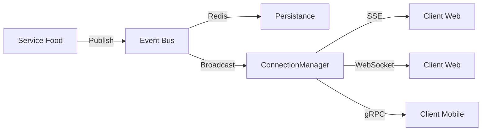

## Vue d'ensemble

Pulse est le système de notifications et messaging en temps réel d'ONO. Il permet aux clients (mobile/web) de recevoir instantanément les mises à jour de leurs commandes, livraisons, et messages.

## Architecture

### Composants

<CardGroup cols={2}>
  <Card title="Event Bus" icon="shuffle">
    Système hybride (Redis + Broadcast) pour la distribution d'événements
  </Card>
  <Card title="SSE" icon="wave-pulse">
    Server-Sent Events pour les notifications web
  </Card>
  <Card title="WebSocket" icon="plug">
    Communication bidirectionnelle pour le chat
  </Card>
  <Card title="gRPC" icon="bolt">
    Streaming haute performance pour mobile
  </Card>
</CardGroup>

### Event Bus Hybride

Le système utilise une architecture hybride pour garantir performance et persistance :

- **Redis Streams** : Persistance des événements (audit, replay)
- **Broadcast en mémoire** : Distribution temps réel ultra-rapide
- **Support Kafka/NATS** : Pour scale-out en production



## Endpoints

### Health Check

```bash
GET /pulse/health
```

**Response:**
```json
{
  "status": "healthy",
  "service": "pulse",
  "components": {
    "cache": "connected",
    "event_bus": "connected",
    "grpc": "running",
    "sse": "ready",
    "websocket": "ready"
  }
}
```

### SSE - Server-Sent Events

Connexion unidirectionnelle serveur → client pour recevoir les notifications.

```bash
GET /pulse/sse/notifications?token={JWT_TOKEN}&topics=food.orders
```

**Paramètres:**
- `token` (required): JWT token d'authentification
- `topics` (optional): Topics à écouter (séparés par virgule)
  - `food.orders` - Commandes food
  - `food.deliveries` - Livraisons food
  - `delivery.status` - Statut de livraison

**Exemple:**
```javascript
const eventSource = new EventSource(
  'https://api.ono.ci/pulse/sse/notifications?token=' + token + '&topics=food.orders'
);

// Écouter les événements
eventSource.addEventListener('food.order.created', (e) => {
  const data = JSON.parse(e.data);
  console.log('Nouvelle commande:', data);
});

eventSource.addEventListener('food.order.status_changed', (e) => {
  const data = JSON.parse(e.data);
  console.log('Statut changé:', data);
});

// Heartbeat (toutes les 15 secondes)
eventSource.addEventListener('message', (e) => {
  if (e.data === ': heartbeat') {
    console.log('Connection alive');
  }
});
```

### WebSocket

Connexion bidirectionnelle pour le chat et interactions temps réel.

```bash
WS /pulse/ws?token={JWT_TOKEN}
```

**Exemple:**
```javascript
const ws = new WebSocket('wss://api.ono.ci/pulse/ws?token=' + token);

ws.onopen = () => {
  // S'abonner à des topics
  ws.send(JSON.stringify({
    type: 'subscribe',
    topics: ['food.orders', 'chat.messages']
  }));
};

ws.onmessage = (event) => {
  const data = JSON.parse(event.data);
  console.log('Message reçu:', data);
};
```

### gRPC

Streaming haute performance pour applications mobiles.

**Port:** `50052`

**Services disponibles:**

#### SubscribeNotifications

Stream unidirectionnel pour recevoir les notifications.

```protobuf
rpc SubscribeNotifications(SubscribeRequest) returns (stream Notification);
```

**Exemple (Kotlin):**
```kotlin
val channel = ManagedChannelBuilder
    .forAddress("api.ono.ci", 50052)
    .useTransportSecurity()
    .build()

val stub = PulseServiceGrpc.newStub(channel)

val request = SubscribeRequest.newBuilder()
    .setUserId(userId)
    .setToken(token)
    .addTopics("food.orders")
    .build()

stub.subscribeNotifications(request)
    .collect { notification ->
        when (notification.type) {
            NotificationType.DELIVERY_UPDATE -> handleDeliveryUpdate(notification)
            NotificationType.CHAT_MESSAGE -> handleChatMessage(notification)
            else -> Log.d("Pulse", "Notification: ${notification.title}")
        }
    }
```

#### SendLocationUpdates

Stream bidirectionnel pour le tracking GPS des livreurs.

```protobuf
rpc SendLocationUpdates(stream LocationUpdate) returns (stream LocationAck);
```

#### Chat

Chat bidirectionnel client ↔ livreur.

```protobuf
rpc Chat(stream ChatMessage) returns (stream ChatMessage);
```

## Types d'événements

### Food Module

#### food.order.created

Émis quand une nouvelle commande est créée.

```json
{
  "id": "uuid",
  "event_type": "food.order.created",
  "source": "food_service",
  "data": {
    "order_id": "uuid",
    "order_number": "FO-ABC123",
    "restaurant_id": "uuid",
    "total_amount": 4500.0,
    "user_id": "uuid"
  },
  "timestamp": "2025-11-04T12:00:00Z"
}
```

#### food.order.status_changed

Émis quand le statut d'une commande change.

```json
{
  "id": "uuid",
  "event_type": "food.order.status_changed",
  "source": "food_service",
  "data": {
    "order_id": "uuid",
    "order_number": "FO-ABC123",
    "customer_id": "uuid",
    "old_status": "Pending",
    "new_status": "CONFIRMED",
    "user_id": "uuid"
  },
  "timestamp": "2025-11-04T12:05:00Z"
}
```

#### food.delivery.assigned

Émis quand un livreur est assigné.

```json
{
  "id": "uuid",
  "event_type": "food.delivery.assigned",
  "source": "food_service",
  "data": {
    "order_id": "uuid",
    "order_number": "FO-ABC123",
    "driver_id": "uuid",
    "restaurant_name": "Restaurant ABC",
    "delivery_address": "123 Rue Example",
    "user_id": "uuid"
  },
  "timestamp": "2025-11-04T12:10:00Z"
}
```

## Configuration

### Variables d'environnement

```bash
# Type d'Event Bus
EVENT_BUS_TYPE=redis  # ou hybrid, kafka, nats

# Redis
REDIS_URL=redis://localhost:6379
REDIS_STREAMS_URL=redis://localhost:6379

# Kafka (optionnel)
KAFKA_BROKERS=kafka1:9092,kafka2:9092

# NATS (optionnel)
NATS_URL=nats://localhost:4222
```

### Choix de l'Event Bus

| Type | Cas d'usage | Avantages |
|------|-------------|-----------|
| **hybrid** | Développement, petite prod | Simple, rapide, persistance Redis |
| **redis** | Production mono-instance | Persistance, replay d'événements |
| **kafka** | Production scale-out | Haute disponibilité, multi-instances |
| **nats** | Microservices distribués | Léger, rapide, cloud-native |

## Monitoring

### Métriques disponibles

```bash
GET /pulse/api/monitoring/health
```

**Response:**
```json
{
  "status": "healthy",
  "checks": [
    {"name": "event_bus", "status": "healthy"},
    {"name": "cache", "status": "healthy"},
    {"name": "grpc", "status": "running"}
  ],
  "active_connections": 42,
  "events_processed": 1523,
  "uptime_seconds": 3600
}
```

## Sécurité

### Authentification

Tous les endpoints Pulse nécessitent un JWT token valide :

```bash
Authorization: Bearer {JWT_TOKEN}
```

### Rate Limiting

- SSE: 10 connexions par utilisateur
- WebSocket: 5 connexions par utilisateur
- gRPC: 100 requêtes/seconde par utilisateur

### Filtrage des événements

Les clients ne reçoivent que les événements pour lesquels ils ont les permissions :
- `user_id` matching
- Topic subscription
- Role-based access

## Exemples d'intégration

### React (Web)

```typescript
import { useEffect, useState } from 'react';

function useOrderNotifications(token: string) {
  const [orders, setOrders] = useState([]);

  useEffect(() => {
    const eventSource = new EventSource(
      `https://api.ono.ci/pulse/sse/notifications?token=${token}&topics=food.orders`
    );

    eventSource.addEventListener('food.order.status_changed', (e) => {
      const data = JSON.parse(e.data);
      setOrders(prev => prev.map(order => 
        order.id === data.order_id 
          ? { ...order, status: data.new_status }
          : order
      ));
    });

    return () => eventSource.close();
  }, [token]);

  return orders;
}
```

### Flutter (Mobile)

```dart
import 'package:grpc/grpc.dart';

class PulseService {
  late ClientChannel channel;
  late PulseServiceClient stub;

  Future<void> connect() async {
    channel = ClientChannel(
      'api.ono.ci',
      port: 50052,
      options: ChannelOptions(
        credentials: ChannelCredentials.secure(),
      ),
    );
    stub = PulseServiceClient(channel);
  }

  Stream<Notification> subscribeNotifications(String token) {
    final request = SubscribeRequest()
      ..userId = userId
      ..token = token
      ..topics.add('food.orders');

    return stub.subscribeNotifications(request);
  }
}
```

## Troubleshooting

### Les événements ne sont pas reçus

1. Vérifier que le token est valide
2. Vérifier les topics souscrits
3. Vérifier les logs serveur pour les erreurs
4. Tester avec curl :

```bash
TOKEN="your_token"
curl -N "http://localhost:9000/pulse/sse/notifications?token=$TOKEN&topics=food.orders"
```

### Connexion SSE se ferme

- Le heartbeat est envoyé toutes les 15 secondes
- Vérifier les proxies/load balancers qui peuvent timeout
- Augmenter le timeout côté client

### Performance

- Utiliser gRPC pour mobile (plus efficace que SSE)
- Limiter les topics souscrits
- Utiliser Kafka en production pour scale-out

## Roadmap

- [ ] Finaliser le bug SSE (événements non reçus)
- [ ] Implémenter les services gRPC complets
- [ ] Ajouter support Kafka en production
- [ ] Dashboard de monitoring temps réel
- [ ] Replay d'événements depuis Redis
